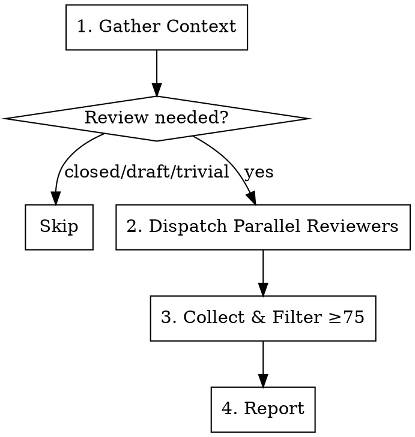
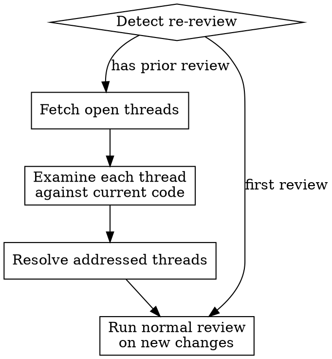

# PR Code Review

Comprehensive pull request review using parallel specialized reviewers. Each reviewer focuses on one aspect of code quality, producing confidence-scored findings filtered to surface only high-signal issues.

**Core principle:** Multiple focused reviewers catch more than one generalist. Confidence scoring eliminates noise.

## When to Use

- Reviewing a pull request before merge
- When asked to "review this PR" or "code review"
- Before approving code for production
- Re-reviewing a PR after the author addresses review comments

**Don't use for:**
- Reviewing local uncommitted changes (review the diff directly instead)
- Architecture review of entire codebase (too broad for PR review)

## Workflow



### Step 1: Gather Context

Collect before dispatching reviewers:

- **PR diff**: `git diff <base>...<head>` (or fetch via PR API)
- **Changed file list**: `git diff --name-only <base>...<head>`
- **Project guidelines**: Look for CLAUDE.md, AGENTS.md, .cursorrules, CONTRIBUTING.md, or similar
- **PR description**: Title, body, linked issues

**Skip review if:** PR is closed, draft, or only touches lockfiles/generated code/CI config.

### Step 2: Dispatch Parallel Reviewers

Launch one subagent per applicable review aspect. Each subagent gets:

1. The PR diff (or relevant file portions)
2. Full content of changed files for context
3. Project guidelines (if found)
4. Aspect-specific instructions from [references/](references/)
5. The output format below

**Select applicable aspects** based on what changed:

| Aspect | When to Include | Reference |
|--------|----------------|-----------|
| Bug Detection | Always | [bug-detection.md](references/bug-detection.md) |
| Error Handling | Code with try/catch, error callbacks, fallbacks | [error-handling.md](references/error-handling.md) |
| Type Design | New or modified type/interface/class definitions | [type-design.md](references/type-design.md) |
| Test Coverage | Always (flag missing tests even if none in diff) | [test-coverage.md](references/test-coverage.md) |
| Comment Quality | Files with doc comments, JSDoc, docstrings | [comment-quality.md](references/comment-quality.md) |
| Guidelines Compliance | When project guidelines file exists | [guidelines-compliance.md](references/guidelines-compliance.md) |

**Subagent prompt template:**

```
You are reviewing a pull request for [ASPECT].
Only report issues introduced by THIS PR, not pre-existing problems.

## PR Context
- Title: [title]
- Description: [body]
- Changed files: [file list]

## Project Guidelines
[guidelines content, or "No project guidelines found."]

## Diff
[diff content]

## Changed File Contents
[full file contents for context around the diff]

## Review Instructions
[paste content from the corresponding references/ file]

## Output Format
For each issue, report as structured data:
- file: path/to/file
- line: line_number
- confidence: 0-100
- severity: critical | important | minor
- issue: What is wrong
- impact: Why it matters if not fixed
- suggestion: Specific fix recommendation
```

### Step 3: Collect and Filter

Merge findings from all reviewers. **Discard anything with confidence < 75.**

Use `git blame` to verify flagged lines were actually changed in this PR. Downgrade or drop findings on pre-existing code.

### Step 4: Report

```markdown
## Review Summary
Reviewed [N] files, [M] lines changed across [K] review aspects.

## Critical Issues (confidence 90-100)
### [file:line] — Issue title (confidence: N)
Description of the issue.
**Impact:** What breaks if not fixed.
**Suggestion:** Specific fix.

## Important Issues (confidence 75-89)
### [file:line] — Issue title (confidence: N)
Description of the issue.
**Impact:** What could go wrong.
**Suggestion:** Specific fix.

## Positive Observations
- [Strengths worth noting]
```

## Posting the Review on GitHub

When the review targets a GitHub PR, submit a formal review — not a plain comment.

**Use inline comments** on specific lines of the diff for each finding. Include the confidence score and suggestion directly in the inline comment.

**Submit a review verdict:**
- **Approve** if no findings at confidence ≥75 remain after filtering
- **Request Changes** if any critical (90-100) or important (75-89) findings exist

Use your platform's PR review API (e.g., `gh api` for GitHub CLI, or equivalent) to post the review with inline comments and a verdict in a single review submission. Do not post findings as individual standalone comments.

## Re-Review: Resolving Addressed Comments

When re-reviewing a PR (the author pushed fixes and re-requested review), resolve inline review threads that have been addressed before running the normal review flow on new changes.

### Re-Review Workflow



### Step R1: Detect Re-Review

A re-review is indicated when:
- The user says "re-review", "follow-up review", or "check if comments are addressed"
- The PR already has review threads from a prior review

### Step R2: Fetch Open Review Threads

Use the GraphQL API to list all unresolved review threads on the PR:

```bash
gh api graphql -f query='
  query($owner: String!, $repo: String!, $pr: Int!) {
    repository(owner: $owner, name: $repo) {
      pullRequest(number: $pr) {
        reviewThreads(first: 100) {
          nodes {
            id
            isResolved
            isOutdated
            path
            line
            comments(first: 5) {
              nodes {
                body
                author { login }
                createdAt
              }
            }
          }
        }
      }
    }
  }
' -f owner='{owner}' -f repo='{repo}' -F pr=PR_NUMBER
```

Filter to only **unresolved** threads (`isResolved: false`).

### Step R3: Examine Each Thread Against Current Code

For each unresolved thread:

1. Read the **current content** of the file at the path indicated by the thread
2. Read the **original review comment** to understand what was flagged
3. Check if the issue described in the comment has been addressed:
   - The problematic code was changed or removed
   - The suggested fix (or equivalent) was applied
   - The thread is marked `isOutdated` (the diff line no longer exists) — likely addressed

**Judgment criteria:**
- If the code at the flagged location clearly addresses the concern → **resolved**
- If the thread is `isOutdated` and the surrounding code looks correct → **resolved**
- If the issue persists unchanged → **unresolved** (leave open)
- If partially addressed or addressed differently than suggested → use judgment; resolve if the concern is no longer valid

### Step R4: Resolve Addressed Threads

For each thread confirmed as addressed, resolve it via GraphQL:

```bash
gh api graphql -f query='
  mutation($threadId: ID!) {
    resolveReviewThread(input: { threadId: $threadId }) {
      thread { isResolved }
    }
  }
' -f threadId='THREAD_ID'
```

**Do not resolve threads that are still valid.** Only resolve threads where the underlying issue has been fixed.

### Step R5: Report and Continue

After resolving addressed threads, report what was resolved and what remains:

```markdown
## Re-Review: Comment Resolution

### Resolved (N threads)
- [file:line] — [brief description of original issue] ✓ Fixed
  
### Still Open (M threads)
- [file:line] — [brief description] — still present / not fully addressed

### Continuing with full review on new changes...
```

Then proceed with the normal review workflow (Steps 1–4) on any new changes since the last review.

## Confidence Scoring

Every finding gets a 0-100 confidence score:

| Range | Meaning | Action |
|-------|---------|--------|
| 90-100 | Definite bug, security issue, or explicit guideline violation | Must fix |
| 75-89 | Likely issue, warrants attention | Should fix |
| 50-74 | Possible concern but uncertain | Filtered out |
| 0-49 | Nitpick, pre-existing, or false positive | Filtered out |

### Confidence adjustments

**Lower confidence when:**
- Issue existed before this PR (check git blame)
- Surrounding code shows intentional pattern
- Would be caught by linter or type checker
- Ambiguous without runtime context
- Style preference rather than correctness

**Raise confidence when:**
- Clear logic error in new code
- Security vulnerability introduced by this PR
- Explicit violation of stated project guidelines
- Missing error handling for obvious failure modes
- Test gap for critical code path

## False Positive Prevention

**DO NOT report:**
- Pre-existing issues not introduced by this PR
- Code following an established project pattern (even if unusual)
- Style nitpicks not in project guidelines
- Issues linters/formatters/type checkers will catch
- Suggestions to add handling where the framework guarantees safety
- Generic "best practice" advice not tied to specific risk in this diff

## Common Mistakes

| Mistake | Correction |
|---------|-----------|
| Reviewing all code in changed files | Only review new/modified lines and their immediate context |
| Reporting pre-existing issues | Use git blame to verify issue is from this PR |
| Flooding with low-confidence findings | Enforce the ≥75 threshold strictly |
| Generic advice ("add more tests") | Specific gaps ("missing test for error path at auth.ts:47") |
| Skipping aspects because PR seems simple | Always run Bug Detection and Test Coverage at minimum |
