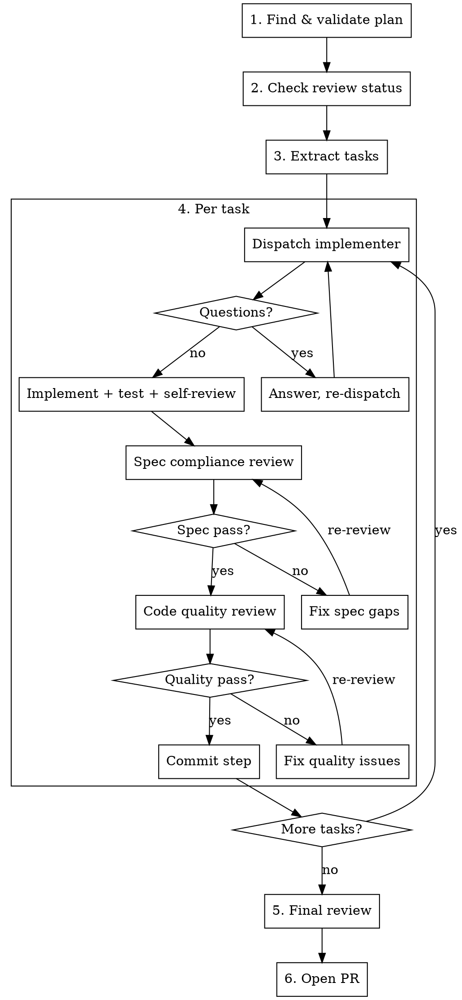

# Ship: Plan to Pull Request

Execute an approved plan by dispatching a fresh subagent per task, with two-stage review
after each (spec compliance, then code quality). Commit after every completed step so the
git history reads like the plan. Open a PR when all tasks pass.

**Core loop:** For each task: implement -> spec review -> quality review -> commit. Then PR.

## When to Use

- A plan file exists in the repo (or the user points you at one)
- The plan has been reviewed and approved (by humans, gstack reviews, or equivalent)
- The user wants to go from "approved plan" to "shipped PR"

**Don't use for:**
- Writing the plan itself (use a planning skill for that)
- Shipping code that's already implemented (use your platform's PR/push workflow)
- Exploratory prototyping with no plan

## Prerequisites

Before starting, verify:
1. You're on a feature branch (not main/master)
2. A plan file exists and is committed (or the user provides one)
3. The working tree is clean (uncommitted changes should be committed or stashed first)

## Workflow



### Step 1: Find and Validate the Plan

Locate the plan file. Check in order:
1. The user specified a file path -- use it
2. Look for recently committed plan files: `git log --diff-filter=A --name-only --format="" -20 | grep -iE 'plan|design|spec|rfc'`
3. Search the repo: files matching `*plan*.md`, `*design*.md`, `*rfc*.md`, `*spec*.md`

If multiple candidates, ask the user which one. Read the plan fully -- you'll need to extract
all tasks and provide their full text to subagents (subagents never read the plan file themselves).

### Step 2: Check Review Status

Scan the plan for evidence of review. Look for:
- A `## GSTACK REVIEW REPORT` section (gstack's autoplan/review pipeline)
- Review comments, approval markers, or sign-off sections
- Git log showing the plan was reviewed: `git log --oneline -- <plan-file>`

**If no review evidence found:** Warn the user: "This plan has no visible review markers.
It's best to review plans before implementing (e.g., with engineering review, design review,
or peer feedback). Proceed anyway?" If the user confirms, continue. If they don't respond,
wait -- don't assume.

**If review evidence found:** Note it briefly and continue. Example: "Plan reviewed via
/autoplan -- eng review CLEAR, CEO review CLEAR. Proceeding."

### Step 3: Extract Tasks

Parse the plan into discrete tasks. Plans typically organize tasks as:
- Numbered sections (`## 1. ...`, `### Task 1: ...`)
- Headed sections (`## Authentication Layer`, `## Database Schema`)
- Checkbox lists (`- [ ] Implement ...`)

For each task, extract:
- **Title**: The heading or first line
- **Full text**: Everything under that heading until the next task heading
- **Dependencies**: Any references to other tasks ("after Task 1", "depends on ...")
- **Files mentioned**: Paths referenced in the task description

Create a task list to track progress. Order tasks respecting dependencies -- independent
tasks can go in any order, but a task that depends on another must come after it.

### Step 4: Execute Tasks (the core loop)

Process tasks sequentially. For each task:

#### 4a. Dispatch Implementer Subagent

Spawn a fresh subagent with the task. The subagent gets:
- Full text of the task (copied from the plan, not a file reference)
- Context about where this fits in the overall plan
- The working directory
- Instructions to implement, test, and self-review

Use the implementer prompt template in [references/implementer-prompt.md](references/implementer-prompt.md).

**Model selection**: Use the least capable model that fits the task complexity.
- 1-2 files, clear spec -> fast/cheap model
- Multi-file integration -> standard model
- Architecture decisions or broad codebase changes -> most capable model

#### 4b. Handle Implementer Response

The implementer reports a status:

| Status | Action |
|--------|--------|
| **DONE** | Proceed to spec review |
| **DONE_WITH_CONCERNS** | Read concerns. If about correctness, address before review. If observations, note and proceed. |
| **NEEDS_CONTEXT** | Provide missing context, re-dispatch |
| **BLOCKED** | Assess: provide more context, use stronger model, break task apart, or escalate to human |

Never ignore an escalation. If the implementer is stuck, something needs to change.

#### 4c. Spec Compliance Review

Dispatch a fresh reviewer subagent to verify the implementation matches the task spec.
The reviewer independently reads the code -- it does not trust the implementer's report.

Use the spec reviewer prompt template in [references/spec-reviewer-prompt.md](references/spec-reviewer-prompt.md).

- If **pass**: proceed to code quality review
- If **fail**: the implementer fixes the gaps, then the spec reviewer re-reviews. Loop until pass.

#### 4d. Code Quality Review

Dispatch a fresh reviewer subagent to check code quality: clean code, test coverage,
file responsibility, maintainability.

Use the code quality reviewer prompt template in [references/code-quality-reviewer-prompt.md](references/code-quality-reviewer-prompt.md).

- If **pass**: proceed to commit
- If **fail**: the implementer fixes the issues, then the quality reviewer re-reviews. Loop until pass.

**Ordering matters:** Never start code quality review before spec compliance passes.
There's no point polishing code that doesn't meet spec.

#### 4e. Commit the Step

After both reviews pass, commit the work with a message that ties back to the plan:

```
<type>: <what was done>

Plan step <N>/<total>: <task title>
```

Example:
```
feat: add JWT authentication middleware

Plan step 2/5: Authentication Layer
```

This makes the git history directly traceable to the plan. Anyone reading the log
can follow the implementation order and connect each commit to its specification.

Mark the task complete in your task tracker and move to the next task.

### Step 5: Final Review

After all tasks are complete, do a holistic review of the entire implementation:
- Read through all changes: `git diff <base>...HEAD`
- Check that tasks integrate correctly (interfaces match, no gaps between components)
- Run the full test suite if one exists
- Look for cross-cutting concerns that per-task reviews might miss

If the final review surfaces issues, fix them and commit as a separate "integration fix" commit.

### Step 6: Open Pull Request

Create a PR that connects the implementation back to the plan:

**Title:** Concise summary of what the plan implements (under 70 characters).

**Body structure:**

```markdown
## Summary

Implements [plan-file-name](link-to-plan-file).

<Brief description of what this plan delivers -- 2-3 sentences.>

## Plan Steps

- [x] Step 1: <title> (<commit-sha>)
- [x] Step 2: <title> (<commit-sha>)
- [x] Step 3: <title> (<commit-sha>)
...

## Review Status

<Paste review status from the plan if available, e.g., gstack review report.>

## Test Plan

- [ ] <Key verification steps for reviewers>
```

Use your platform's CLI to create the PR (e.g., `gh pr create` for GitHub, `glab mr create`
for GitLab). Push the branch first if needed.

## Red Flags

**Never:**
- Skip either review stage (spec compliance OR code quality)
- Dispatch multiple implementer subagents in parallel (they'll conflict on shared files)
- Make a subagent read the plan file (provide full text in the prompt)
- Start code quality review before spec compliance passes
- Proceed past a failed review without fixes and re-review
- Commit broken or untested code for the sake of traceability
- Force-push or rewrite history -- each commit is a trace of a completed step

**If something goes wrong:**
- Implementer fails -> re-dispatch with more context or stronger model, don't retry blindly
- Review finds issues -> implementer fixes, reviewer re-reviews, repeat until clean
- Entire task is misspecified -> escalate to user, don't implement something wrong
- Test suite breaks -> fix before committing, don't commit broken tests

## Integration with Other Skills

This skill works well with:
- **Plan creation skills** (gstack's `/autoplan`, superpowers' `writing-plans`) for creating the plan
- **Plan review skills** (gstack's `/plan-eng-review`, `/plan-ceo-review`) for approving the plan
- **Code review skills** (`pr-code-review`) for reviewing the final PR
- **superpowers' `finishing-a-development-branch`** for wrapping up after the PR is created
